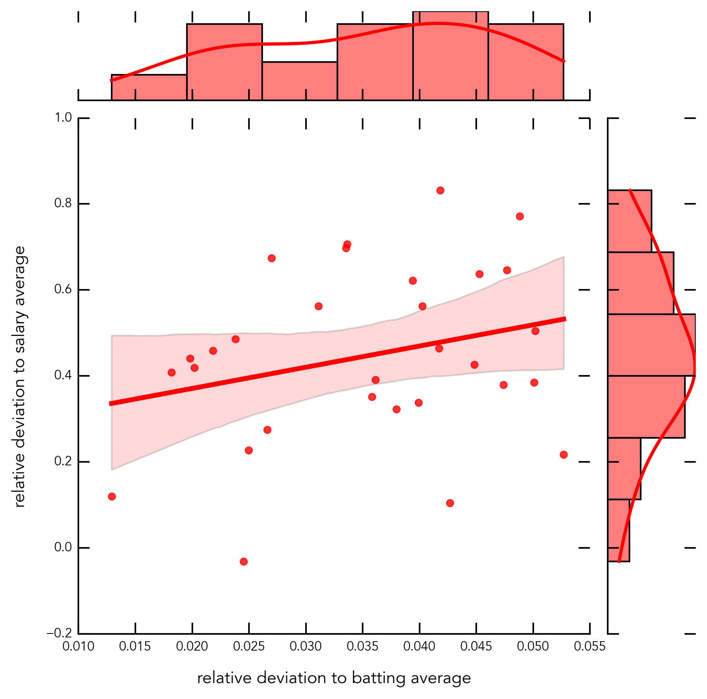
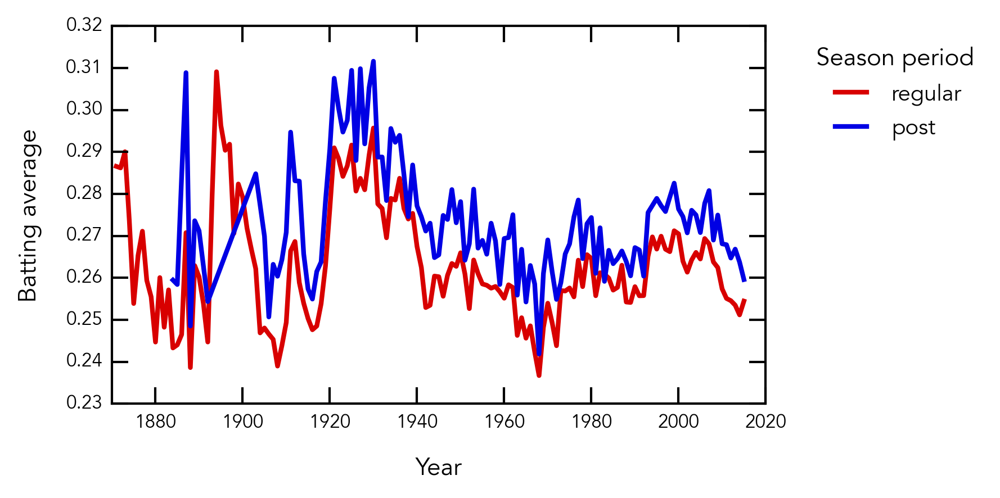
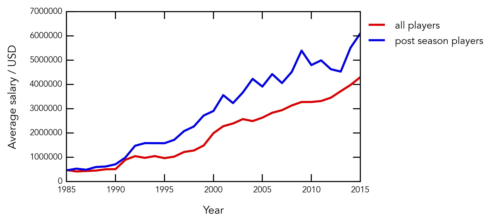

# Data Analysis - Baseball Dataset

This repo contains a part of the final project of my [Intro to Programming Nanodegree](https://www.udacity.com/course/intro-to-programming-nanodegree--nd000) I completed in 2016. During the program I learned the basics of HTML, CSS, Python, & JavaScript. I specialized in Data Analysis during my final project. A few of my early skills are demonstrated in the jupyter notebook:
* Numpy & Pandas 
* Matplotlib
* Seaborn
* Parsing, wrangling, and analysing big datasets
## Description

The goal of the project was to explore and analyze an unkown Baseball dataset containg all sorts of statistics since 1880. Below you can find a variety of plots I created using Pandas & Matplotlib & Seaborn.

## Python 
The code is entirely written in Python. It utilizes the Pandas,Matplotlib, and Seaborn framework.

## Dependencies for Running Locally
* Jupyter Lab: pip3 install jupyterlab
* Pandas: pip3 install pandas
* Matplotlib:: pip3 install matplotlib
* Seaborn: pip3 install seaborn

## Basic Build Instructions

1. Clone this repo.
2. Launch Jupyter Lab.
3. Open Notebook.
4. Run.
